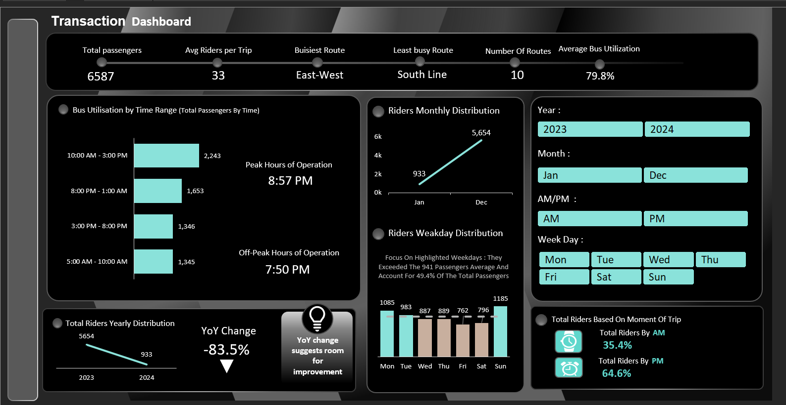
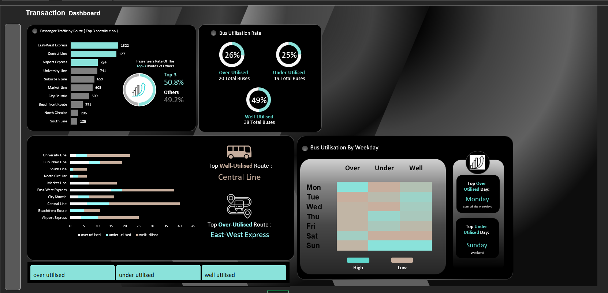

# Bus Transportation Analysis

> An Excel-based analysis of bus ridership and fleet utilization, exploring passenger demand, operating periods, route performance, and bus utilization.

`EXCEL` · `DATA ANALYSIS` · `DATA VISUALIZATION` · `BUSINESS ANALYTICS`

---

## Project Overview

This project uses **Excel** to analyze bus transportation data from both a passenger-demand and operational perspective.

The analysis is presented through **two dashboards**. The first focuses on overall ridership patterns, demand across different time periods, and fleet utilization. The second provides a more detailed view of **utilization across individual routes and weekdays**, helping identify where transportation capacity may be over- or under-utilized.

---

## Dashboard Previews

### Ridership & Utilization Overview

<p align="center">
  
</p>

### Route & Weekday Utilization

<p align="center">
  
</p>

---

## Analysis Focus

- Passenger demand across different **time ranges**
- Monthly and yearly **ridership distribution**
- Ridership patterns across **weekdays**
- **AM vs PM** passenger distribution
- Peak and off-peak operating periods
- Overall fleet classification into **over-utilized, well-utilized, and under-utilized buses**
- Utilization levels across individual **bus routes**
- Comparison of **bus utilization by weekday**

---

## Key Insights

- The **10 AM–3 PM period** recorded the highest passenger volume with **2,243 riders**, making it the strongest demand period.

- Passenger activity was considerably higher during **PM trips**, which accounted for approximately **64.6% of total riders**, compared with **35.4% during AM trips**.

- Overall fleet analysis classified approximately **49% of buses as well-utilized**, while **26% were over-utilized** and **25% were under-utilized**, showing that roughly half of the fleet operated outside the desired utilization range.

- The route-level analysis shows that utilization is **not distributed equally across routes**. Some routes contain a greater number of well-utilized buses, while others show a stronger presence of over- or under-utilized buses.

- Weekday analysis provides an additional view of when utilization is **high or low**, helping identify periods where bus capacity could potentially be redistributed.

Together, the two dashboards show both **when passenger demand occurs and where fleet capacity is being used effectively or inefficiently**.

---

## Tools & Skills

| Area | Skills |
|---|---|
| **Excel** | PivotTables, formulas, dashboard development |
| **Data Visualization** | KPI reporting, charts, conditional formatting |
| **Data Analysis** | Ridership, route, time-period and utilization analysis |
| **Business Analytics** | Capacity analysis and operational performance evaluation |

---

## Repository Structure

```text
Bus-Transportation-Analysis/
│
├── README.md
├── bus_transportation_analysis.xlsx
│
└── assets/
    ├── bus-ridership-dashboard.png
    └── bus-utilization-dashboard.png
```

---

## Conclusion

This project demonstrates how **Excel can be used to evaluate both passenger demand and transportation capacity**. By combining overall ridership analysis with route- and weekday-level utilization, the dashboards help identify demand patterns and areas where fleet allocation could be improved.
